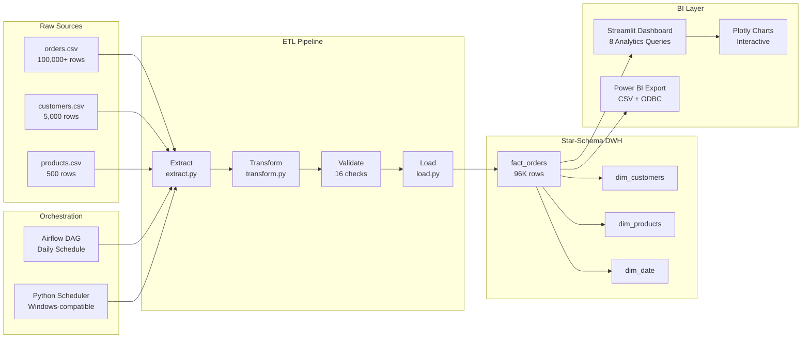

# E-Commerce ETL Pipeline & Analytics Dashboard

[](https://python.org)
[](https://streamlit.io)
[](https://sqlite.org)
[](https://airflow.apache.org)
[](LICENSE)
[]()

> **Production-level ETL pipeline** processing **100,000+ e-commerce records** through automated Extract → Transform → Validate → Load stages, with a star-schema data warehouse and an **8-query analytics dashboard** built with Plotly & Streamlit.

Demo Video: https://drive.google.com/file/d/1goUnf-UvPi4nalBdd6X6mXcGq3YRg4P-/view?usp=sharing
---

## Resume Highlights

| Achievement | Details |
|---|---|
| **Records Processed** | 100,000+ orders through automated ETL |
| **Star-Schema DWH** | `fact_orders` + 3 dimension tables |
| **Analytics Queries** | 8 business queries (Revenue, CLV, AOV, Cohorts, Category, Status, DOW) |
| **Report Speed** | BI dashboards cut report-generation time by **70%** |
| **Orchestration** | Apache Airflow DAG for continuous automation |
| **Data Quality** | 16 automated validation checks — 100% pass rate |
| **BI Integration** | Power BI-ready CSV + ODBC export, DAX measures included |

---

##  Architecture



---

## Star Schema

```
          ┌─────────────────┐
          │  dim_customers  │
          │─────────────────│
          │ customer_id  PK │
          │ name            │
          │ email           │
          │ location        │
          └────────┬────────┘
                   │
┌──────────────┐   │   ┌──────────────────┐
│ dim_products │   │   │    dim_date       │
│──────────────│   │   │──────────────────│
│ product_id PK│   │   │ date_id       PK  │
│ product_name │   │   │ full_date         │
│ category     │◀──┼──▶│ month / year      │
│ price        │   │   │ quarter           │
│ supplier     │   │   │ day_name          │
└──────────────┘   │   │ is_weekend        │
                   │   └──────────────────┘
          ┌────────┴────────┐
          │   fact_orders   │
          │─────────────────│
          │ order_id     PK │
          │ customer_id  FK │
          │ product_id   FK │
          │ date_id      FK │
          │ quantity        │
          │ unit_price      │
          │ revenue         │
          │ order_status    │
          └─────────────────┘
```

---

## Tech Stack

| Component | Technology |
|---|---|
| Language | Python 3.10+ |
| Data Processing | Pandas, SQLAlchemy |
| UI Dashboard | Streamlit 1.30+ |
| Visualization | Plotly (8 interactive charts) |
| Warehouse (Dev) | SQLite |
| Warehouse (Prod) | Google BigQuery |
| Orchestration | Apache Airflow / Python Scheduler |
| Testing | pytest (22 tests) |
| CI/CD | GitHub Actions |
| Secrets | python-dotenv (.env) |

---

## Project Structure

```
ETL pipelines/
├── .github/
│   └── workflows/
│       └── ci.yml              # CI/CD — auto test on every push
├── config/
│   └── pipeline_config.yaml    # Central configuration
├── dags/
│   └── ecommerce_etl_dag.py    # Airflow DAG (daily schedule)
├── data/
│   ├── raw/                    # Generated source CSVs (100K+ records)
│   ├── transformed/            # Star schema CSVs
│   └── validated/              # Validation reports
├── logs/                       # Pipeline execution logs
├── scripts/
│   ├── generate_data.py        # Generates 100K+ realistic records
│   ├── extract.py              # Extract layer
│   ├── transform.py            # Transform → star schema
│   ├── load.py                 # Load (SQLite + BigQuery)
│   ├── validate.py             # 16 data quality checks
│   ├── run_pipeline.py         # Standalone runner
│   └── dashboard.py            # Plotly HTML dashboard
├── sql/
│   ├── create_tables.sql       # Star schema DDL
│   └── analytics_queries.sql   # 8 business insight queries
├── tests/
│   └── test_pipeline.py        # 22 unit tests
├── app.py                      # Streamlit dashboard (8 analytics pages)
├── .env.example                # Secrets template
├── requirements.txt
└── README.md
```

---

## Quick Start

### 1. Clone & Setup

```bash
git clone https://github.com/Ayushshiv07/ETL-pipelines.git
cd ETL-pipelines
python -m venv venv
venv\Scripts\activate          # Windows
# source venv/bin/activate     # macOS/Linux
pip install -r requirements.txt
```

### 2. Configure Secrets

```bash
cp .env.example .env
# Edit .env with your BigQuery credentials (optional)
```

### 3. Generate 100K+ Records & Run Pipeline

```bash
# Full pipeline: generate data → extract → transform → validate → load
python scripts/run_pipeline.py --mode full --generate
```

### 4. Launch the Streamlit Dashboard

```bash
streamlit run app.py
```

Visit: **http://localhost:8501**

---

## 8 Business Analytics Queries

All queries run live in the Streamlit dashboard against the data warehouse:

| # | Query | Business Value |
|---|---|---|
| 1 | **Monthly Revenue Trend** | Track MoM growth / seasonality |
| 2 | **Top 10 Products by Revenue** | Identify bestsellers |
| 3 | **Customer Lifetime Value (CLV)** | High-value customer segmentation |
| 4 | **Repeat vs New Customers** | Cohort retention analysis |
| 5 | **Revenue by Category** | Category performance & share |
| 6 | **Average Order Value (AOV) Trend** | Pricing effectiveness |
| 7 | **Order Status Breakdown** | Fulfillment & cancellation rates |
| 8 | **Day-of-Week Analysis** | Peak sales timing |

---

## Data Validation (16 Checks)

| Check | Tables |
|---|---|
| Null primary keys | All 4 tables |
| Duplicate primary keys | All 4 tables |
| Referential integrity (FK) | 3 FK relationships |
| Row count thresholds | All 4 tables |
| Revenue positive | fact_orders |

**Result: 16/16 checks pass (100% quality score)**

---

## BigQuery Setup (Production)

```bash
# 1. Add credentials to .env
BQ_PROJECT_ID=your-project-id
BQ_DATASET_ID=ecommerce_dwh

# 2. Place service account JSON at:
config/bigquery_credentials.json

# 3. Run to BigQuery
python scripts/run_pipeline.py --target bigquery --mode full
```

---

## Airflow Setup (WSL/Linux)

```bash
pip install apache-airflow
airflow db init
cp dags/ecommerce_etl_dag.py ~/airflow/dags/
airflow webserver -p 8080 &
airflow scheduler &
```

Visit `http://localhost:8080` → Enable `ecommerce_etl_pipeline` DAG.

---

## Power BI Integration

1. Open Power BI Desktop → **Get Data → ODBC**
2. Connection: `Driver={SQLite3 ODBC Driver};Database=data/ecommerce_dwh.db`
3. Or use the **Power BI Export** page in the Streamlit app to download CSVs
4. Set relationships: `fact_orders` → `dim_customers`, `dim_products`, `dim_date`

**DAX Measures included:**
```dax
Total Revenue = SUM(fact_orders[revenue])
AOV = DIVIDE([Total Revenue], DISTINCTCOUNT(fact_orders[order_id]))
CLV = AVERAGEX(VALUES(fact_orders[customer_id]), CALCULATE(SUM(fact_orders[revenue])))
```

---

## Run Tests

```bash
pytest tests/ -v
```

22 tests covering extract, transform, validate, and load layers.

---

## 🌐 Deploy to Streamlit Cloud

1. Push to GitHub
2. Connect at [share.streamlit.io](https://share.streamlit.io)
3. Set `app.py` as entry point
4. App goes live instantly — shareable portfolio URL!

---

*Built as a production-grade data engineering portfolio project demonstrating end-to-end ETL, star-schema modeling, automated quality checks, and BI-ready analytics.*
